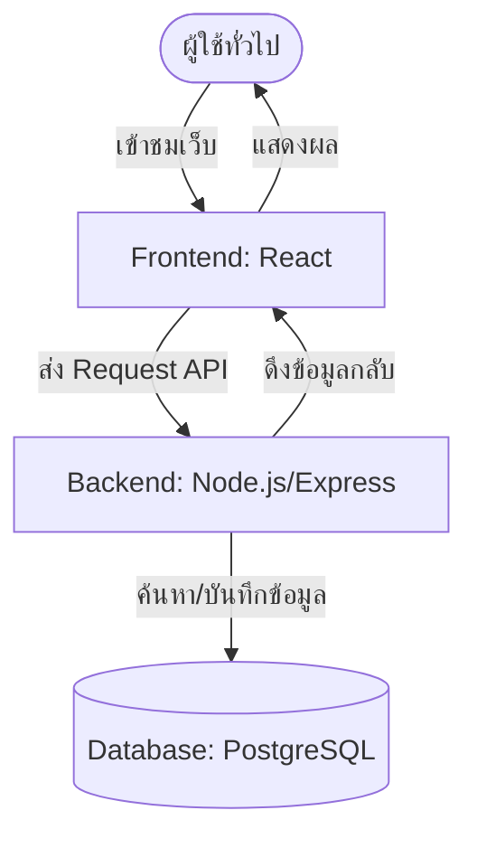

# 3.2 การออกแบบระบบและสถาปัตยกรรม (System Design)

แสดงโครงสร้าง ไดอะแกรม และสถาปัตยกรรมภายในระบบทั้งหมดเพื่อแสดงให้เห็นการเชื่อมต่อของข้อมูล

---

## 📝 คำแนะนำในการเขียน
คุณสามารถแนบหรือวาด Diagrams สำคัญด้านล่างนี้:
1.  **System Architecture Diagram**: ภาพโครงสร้างภาพใหญ่ว่า Client คุยกับ Server อย่างไร ข้อมูลถูกเก็บที่ไหน
2.  **Use Case Diagram**: บทบาทของผู้ใช้แต่ละกลุ่ม (User, Admin) ในการทำธุรกรรมหรือใช้งานส่วนต่างๆ
3.  **Database Design (ER-Diagram หรือ Schema)**: โครงสร้างตารางต่างๆ ในฐานข้อมูลและความสัมพันธ์
4.  **UI/UX Wireframes / Mockups**: หน้าตาจำลองของแอปพลิเคชัน

---

## 🎨 ตัวอย่างการวาด Diagram ด้วย Mermaid (ใน Obsidian)
คุณสามารถใช้โค้ดด้านล่างเป็นไกด์ไลน์เพื่อแสดง Flow ของระบบได้:

---

## ✍️ พื้นที่เขียนและแนบภาพการออกแบบระบบ
### 3.2.1 สถาปัตยกรรมระบบ (System Architecture)
*(คำอธิบายภาพและแนบไฟล์รูปภาพ)*

### 3.2.2 การออกแบบฐานข้อมูล (Database Design)
*(ตารางข้อมูลหรือ ER-Diagram)*
